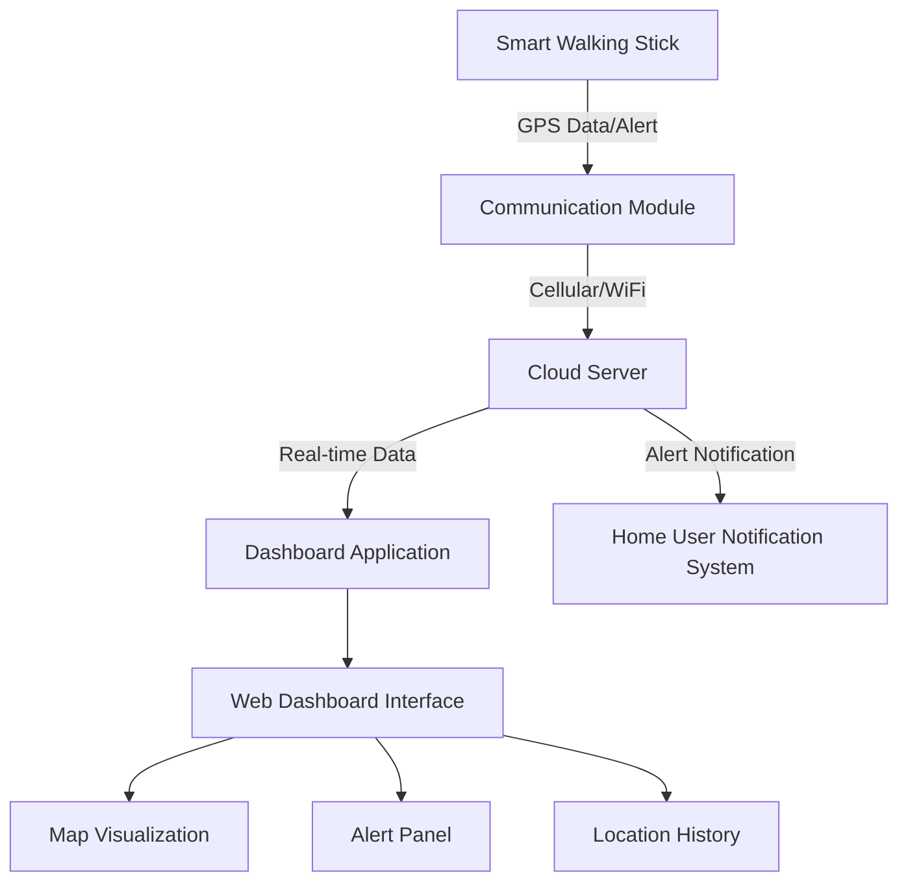

# Blindman Stick Tracking System Architecture

## Overview
This system provides real-time location tracking for blind individuals with a smart walking stick. The system includes a dashboard for home users to monitor the stick's location and receive alerts when the user needs assistance.

## System Architecture Diagram

## Component Details

### 1. Smart Walking Stick
- GPS module for location tracking
- Emergency button for alerting
- Communication module (cellular/WiFi)
- Power management system

### 2. Communication Module
- Transmits GPS coordinates at regular intervals
- Sends alert signals when button is pressed
- Handles data encryption for security

### 3. Cloud Server
- Receives and processes location data
- Manages alert notifications
- Stores location history
- Handles user authentication and permissions

### 4. Dashboard Application
- Real-time map visualization
- Alert notification panel
- Location history tracking
- User management interface

### 5. Home User Notification System
- Push notifications to mobile devices
- Email alerts
- SMS alerts (optional)
- Dashboard alert indicators

## Technology Stack Recommendations

### Backend
- Node.js with Express for API development
- MongoDB for data storage
- Socket.IO for real-time communication
- Redis for caching

### Frontend
- React.js for dashboard UI
- Leaflet.js or Google Maps API for map visualization
- WebSocket for real-time updates

### Mobile Notification
- Firebase Cloud Messaging for push notifications
- Twilio for SMS alerts (optional)

## Data Flow

1. Smart stick collects GPS data at regular intervals
2. Data is transmitted via cellular/WiFi to cloud server
3. Server processes and stores location data
4. Dashboard application fetches real-time data from server
5. When alert button is pressed, server sends notification to home user
6. Home user receives alert via multiple channels (dashboard, push, email, SMS)

## Security Considerations

- End-to-end encryption for data transmission
- User authentication and authorization
- Secure API endpoints
- Regular security audits